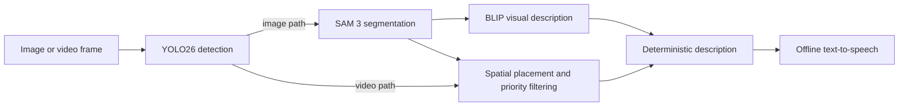

# Assistive Visual AI

Assistive Visual AI is an image-to-speech prototype that converts visual scenes into short, prioritised spoken descriptions. It combines pretrained vision models with deterministic language generation so that the final output remains auditable and does not depend on a hosted language-model API.

## Overview

The application supports two processing paths:

- **Image mode** prioritises detail. It runs object detection, promptable segmentation, BLIP-based visual understanding, spatial aggregation, and text-to-speech.
- **Video mode** prioritises responsiveness. It removes the expensive segmentation and captioning stages, then periodically describes important detected objects and their left/centre/right positions.



## Technical Approach

- **Object detection:** Ultralytics YOLO26n produces class labels, confidence values, and bounding boxes.
- **Segmentation:** SAM 3 receives unique high-confidence object labels and produces instance masks for the detailed image path.
- **Visual understanding:** BLIP-VQA generates a short global scene description; BLIP2 is available as a heavier alternative.
- **Spatial language:** object centroids are divided into left, centre, and right regions. Safety-relevant classes receive higher priority before duplicate objects are counted and verbalised.
- **Speech:** `pyttsx3` provides offline text-to-speech. Frame processing runs on a worker thread so speech generation does not block the interface.

## Evaluation

The evaluation utilities measure three separate properties on an exact 100-image subset of COCO val2017:

| Measure | Observed result | Interpretation |
| --- | ---: | --- |
| Mean mask IoU | 0.576 | Segmentation generally found the correct region but was not pixel-perfect. |
| YOLO latency | 0.025 s/image | Detection was fast enough for the lightweight path on the evaluation machine. |
| Full image pipeline latency | 3.99 s/image | SAM 3 accounted for roughly 94.5% of runtime. |

The practical conclusion is architectural: the detector-plus-template path is the realistic option for repeated video descriptions, while segmentation and captioning are better reserved for deliberate one-off image queries.

## Installation

Python 3.11 or later and a CUDA-capable GPU are recommended for the full image pipeline.

```bash
python -m venv .venv
source .venv/bin/activate
pip install -r requirements.txt
```

No pretrained weights are committed. On first use, Ultralytics and Hugging Face resolve the default model identifiers and download the required weights into their managed caches. Model identifiers can be overridden without editing source:

```bash
export AVA_YOLO_MODEL=yolo26n.pt
export AVA_SAM3_MODEL=facebook/sam3
export AVA_BLIP_MODEL=Salesforce/blip-vqa-base
export AVA_BLIP2_MODEL=Salesforce/blip2-flan-t5-xl
```

Access to a gated model, if required by the upstream provider, must be configured through the relevant Hugging Face account. The former repository-local YOLO checkpoint is not required; `yolo26n.pt` is the Ultralytics model identifier used by the default configuration.

## Running the Application

```bash
python main.py
```

Choose an image or MP4 file in the Tkinter interface. Debug mode shows intermediate detections, masks, object structures, and generated text.

## Reproducing the COCO Evaluation

The repository contains only the filtered annotation files that define the 100-image sample. The image copies are deliberately omitted. Download the exact matching images from the original URLs recorded in the annotations, preserving each image's upstream licence metadata:

```bash
python evaluation/download_coco_subset.py
python evaluation/main_eval.py \
  --images-dir coco_100/val2017 \
  --instances coco_100/annotations/instances_val2017_100.json \
  --captions coco_100/annotations/captions_val2017_100.json \
  --limit 100
```

Generated CSV results are written under `evaluation/results/` and are ignored by Git.

## Project Structure

```text
assistive-visual-ai/
├── main.py              # GUI and image/video orchestration
├── vision/              # Detection, segmentation, captioning, and spatial logic
├── language/            # Deterministic sentence construction
├── audio/               # Offline speech output
├── evaluation/          # IoU, description, and latency evaluation
└── coco_100/annotations # Definition and metadata for the evaluation subset
```

## Limitations

- The detailed image pipeline is not real-time on the evaluated consumer GPU.
- Bounding-box position does not estimate depth or collision risk.
- COCO classes omit assistive-critical concepts such as kerbs, crossings, steps, and doorways.
- COCO captions are not an ideal reference for short spatial instructions.
- The prototype has not been validated through a formal study with blind or low-vision users.

## Third-Party Assets

Pretrained models and COCO images retain their upstream licences. Ultralytics YOLO is offered under AGPL-3.0 and commercial licensing options; COCO images use per-image licences recorded in the annotation metadata. Review those terms before redistribution or commercial use.

The repository's existing MIT notice is retained for the named copyright holder. Confirm copyright provenance before changing that notice or relicensing the project.
