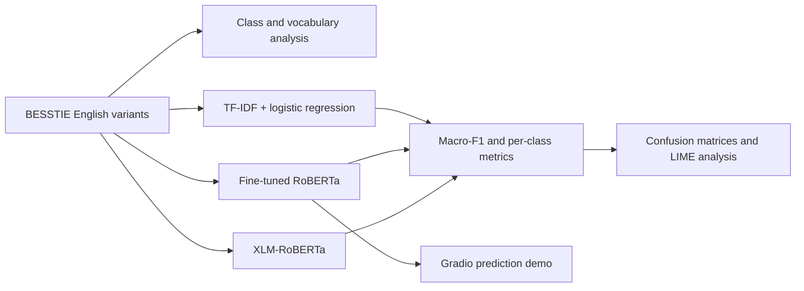

# English Variants Sentiment and Sarcasm

This project studies how sentiment and sarcasm classifiers behave across British, Australian, and Indian English, with particular attention to dialect-specific vocabulary, code-mixing, and cross-variety generalisation.

## Overview

The analysis uses the `surrey-nlp/BESSTIE-CW-26` dataset from Hugging Face. It combines exploratory linguistic analysis with classical and transformer-based experiments for two binary tasks: sentiment and sarcasm classification.

## Technical Approach



The notebook includes:

- class-balance analysis by English variety;
- dialect vocabulary and tokenisation diagnostics;
- TF-IDF/logistic-regression baselines;
- multi-seed RoBERTa fine-tuning;
- UK+Australian-to-Indian transfer experiments;
- RoBERTa versus XLM-RoBERTa comparison;
- per-variety confusion matrices and error categories;
- LIME explanations for selected failures;
- a simple Gradio inference interface.

## Selected Results

The preserved results show that model scale and multilingual pretraining did not automatically improve this English-only task.

| Test variety | RoBERTa sarcasm macro-F1 | XLM-R macro-F1 |
| --- | ---: | ---: |
| Australian English | 0.664 | 0.564 |
| Indian English | 0.597 | 0.510 |
| British English | 0.756 | 0.616 |

In a separate Indian-English generalisation experiment, training on British and Australian data reached a macro-F1 of 0.613, compared with 0.498 when training only on the smaller Indian-English subset. This suggests that additional cross-variety data outweighed the domain-match advantage in that experiment.

## Running the Notebook

```bash
python -m venv .venv
source .venv/bin/activate
pip install -r requirements.txt
python -m spacy download en_core_web_sm
jupyter lab english-variants-analysis.ipynb
```

The dataset is downloaded through the Hugging Face `datasets` library. Model training can require several gigabytes of downloads and is substantially faster on a CUDA-capable GPU. Generated fine-tuned checkpoints and figures are local outputs and should not be committed.

## Limitations

- Results come from one dataset and may not generalise to other platforms or topics.
- Sarcasm is highly context-dependent; isolated text labels omit speaker and conversation context.
- Per-variety sample sizes and class balance differ.
- LIME provides local approximations, not causal explanations.
- The notebook records experimental outputs but does not package a production inference service.
