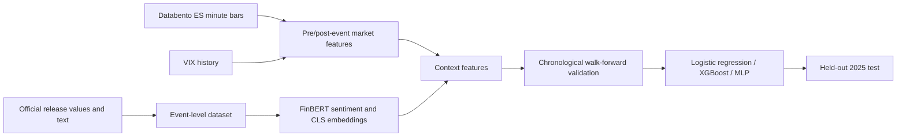

# Macroeconomic Event Impact Modelling

This project investigates whether official macroeconomic releases and the surrounding market context contain enough signal to predict the direction of short-horizon S&P 500 futures returns.

## Research Question

The central question is deliberately narrow: after a scheduled US macroeconomic release, can structured surprise values, finance-domain text representations, and pre-event market conditions predict the sign of the following 30-minute ES futures return?

The analysis covers 513 releases from 2016 through 2025 across CPI, advance GDP, non-farm payrolls, core PCE, and retail sales.

## Technical Approach



### Data preparation

- Aligns scheduled releases with official text and structured surprise variables.
- Builds post-release 30-minute direction labels from ES futures minute bars.
- Adds prior VIX close, pre-event realised volatility, volume, momentum, and release context.
- Produces both binary direction and three-class direction targets.

### Text representation

- Uses finance-domain FinBERT sentiment probabilities.
- Extracts FinBERT CLS embeddings from cleaned official release text.
- Compares raw and filtered text and records token-length diagnostics.
- Applies dimensionality reduction inside the training workflow rather than fitting it globally.

### Evaluation design

- Data is sorted chronologically rather than randomly shuffled.
- Walk-forward folds validate on later years than their corresponding training data.
- Scaling, imputation, PCA, early stopping, and hyperparameter selection are performed without using the final test period.
- The complete 2025 period is reserved for one final evaluation: 46 usable events after market-window filtering, with 463 earlier events used for model development.

## Results

The final results show limited but measurable predictive signal rather than a production-ready trading model.

| Target | Selected model | Feature set | Test accuracy | Test macro-F1 |
| --- | --- | --- | ---: | ---: |
| Binary direction | MLP | Context only | 0.543 | 0.542 |
| Three-class direction | Logistic regression | Context only | 0.500 | 0.503 |

The most important result is methodological: richer FinBERT features did not consistently outperform compact market/context features on the held-out period. Performance and event-level correlations also shifted materially between validation years and 2025, demonstrating the instability expected from a small, non-stationary macro-event sample.

## Notebooks

Run the notebooks in order:

1. [`01-data-processing-and-eda.ipynb`](01-data-processing-and-eda.ipynb) — event alignment, market features, labels, quality checks, and exploratory analysis.
2. [`02-finbert-embeddings-and-text-diagnostics.ipynb`](02-finbert-embeddings-and-text-diagnostics.ipynb) — FinBERT features, token diagnostics, sentiment comparisons, and embedding generation.
3. [`03-walk-forward-model-comparison.ipynb`](03-walk-forward-model-comparison.ipynb) — leakage-aware validation, baseline comparison, optimisation, and held-out testing.

## Environment

```bash
python -m venv .venv
source .venv/bin/activate
pip install -r requirements.txt
```

The notebooks support a `MACRO_PROJECT_ROOT` environment variable. When it is not set, they use the project directory as their root. Expected local data paths are documented in the first notebook.

## Data Availability

Raw licensed Databento minute-level market data is intentionally not redistributed. The repository also omits derived tables that would reproduce licensed observations. Existing notebook outputs preserve the figures, diagnostics, model comparisons, confusion matrices, and classification reports required to review the work. To reproduce the pipeline from scratch, provide appropriately licensed ES minute bars and the public macroeconomic/VIX inputs under the paths described in the notebooks.

## Limitations

- Only 46 events were available for the final 2025 test after filtering.
- Macro-event relationships change across policy, volatility, and liquidity regimes.
- Scheduled releases overlap with other news and market-specific shocks.
- Thirty-minute directional labels compress a complex price response into a small target.
- The results do not include transaction costs, slippage, execution delay, or a trading simulation.

This project is a research and evaluation pipeline, not investment advice or evidence of a deployable trading strategy.
