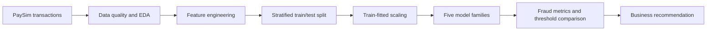

# PaySim Fraud Detection

This project compares supervised-learning approaches for detecting fraudulent transactions in the highly imbalanced PaySim mobile-money simulation dataset.

## Overview

Fraud detection is not well represented by overall accuracy: a model can classify almost every transaction as legitimate and still appear successful. The analysis therefore focuses on fraud-class precision, recall, F1, ROC-AUC, and especially PR-AUC, alongside confusion matrices and operational interpretation.

## Technical Approach



The preparation notebook:

- restricts the analysis to transaction types relevant to observed fraud;
- removes raw account identifiers and the ineffective source-rule flag;
- engineers balance-error, amount-to-balance, and transaction-type features;
- performs a stratified split before fitting the numeric scaler;
- writes reusable train/test matrices locally under `data/processed/`.

The modelling notebooks compare logistic-regression baselines with Gradient Boosting, Random Forest, Decision Tree, K-Nearest Neighbours, and Naive Bayes. Class weights or under-sampling are used where supported by the model.

## Reported Results

The final comparison notebook reports Random Forest as the strongest candidate:

| Metric | Reported value |
| --- | ---: |
| Accuracy | 0.9999 |
| Fraud precision | 1.0000 |
| Fraud recall | 0.9130 |
| Fraud F1 | 0.9545 |
| ROC-AUC | 0.9899 |
| PR-AUC | 0.9357 |

These values come from the preserved notebook outputs and have not been recomputed during portfolio cleanup.

### Evaluation limitation

The model notebooks use manually selected probability thresholds when evaluating the held-out test data. The repository does not preserve a separate validation-only threshold-selection procedure, so the threshold-dependent precision, recall, and F1 values may be optimistic. A production-quality revision should select thresholds on a validation split or within cross-validation, lock the threshold, and evaluate the test set once. The ranking and business recommendation should be treated as exploratory until that workflow is rerun.

## Notebooks

Run in numerical order:

1. [`01-data-preparation-and-eda.ipynb`](notebooks/01-data-preparation-and-eda.ipynb)
2. [`02-gradient-boosting.ipynb`](notebooks/02-gradient-boosting.ipynb)
3. [`03-random-forest.ipynb`](notebooks/03-random-forest.ipynb)
4. [`04-decision-tree.ipynb`](notebooks/04-decision-tree.ipynb)
5. [`05-knn.ipynb`](notebooks/05-knn.ipynb)
6. [`06-naive-bayes.ipynb`](notebooks/06-naive-bayes.ipynb)
7. [`07-model-comparison-and-recommendations.ipynb`](notebooks/07-model-comparison-and-recommendations.ipynb)

## Running the Project

```bash
python -m venv .venv
source .venv/bin/activate
pip install -r requirements.txt
```

Download the PaySim sample linked by the [original PaySim project](https://github.com/EdgarLopezPhD/PaySim) from its [Kaggle dataset page](https://www.kaggle.com/datasets/ealaxi/paysim1). Keep the downloaded archive under its original `paysim1.zip` name and place it at:

```text
data/raw/paysim1.zip
```

Run `01-data-preparation-and-eda.ipynb` from the `notebooks/` directory. It creates `data/processed/` and regenerates `X_train.csv`, `X_test.csv`, `y_train.csv`, and `y_test.csv` for the subsequent model notebooks. Raw and processed datasets are intentionally ignored by Git and are not redistributed here.

The dataset originates from the PaySim simulator by Edgar Alonso López-Rojas, Ahmad Elmir, and Stefan Axelsson. Follow the attribution and usage terms published with the upstream dataset.

## Project Structure

```text
paysim-fraud-detection/
├── notebooks/       # Ordered analysis and model notebooks
├── data/
│   ├── raw/         # Local source archive; not committed
│   └── processed/   # Generated train/test matrices; not committed
└── requirements.txt
```

## Limitations and Next Steps

- PaySim is simulated data and cannot reproduce every behavioural or operational property of real fraud.
- Thresholds need to be selected independently from the test set.
- Time-aware or entity-aware validation would better represent deployment drift and repeated-account behaviour.
- Probability calibration, cost-sensitive thresholds, and monitoring for changing fraud prevalence should precede operational use.
