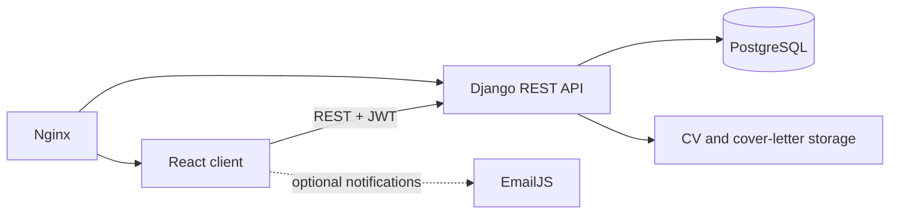

# Ready Jobs

Ready Jobs is a full-stack job platform that connects graduates with employers and supports the complete journey from job discovery to application review.

## Overview

The application provides separate graduate and employer experiences. Graduates can browse and filter vacancies, bookmark roles, submit CV and cover-letter applications, and track application status. Employers can publish vacancies, manage their own listings, review applicants, and update application outcomes. Profile and job tags feed a lightweight recommendation score.

## Architecture



- **Frontend:** React, React Router, React Bootstrap, React Query, and Axios.
- **Backend:** Django and Django REST Framework with serializers, viewsets, role-aware endpoints, and Simple JWT authentication.
- **Persistence:** PostgreSQL models for users, graduate/employer profiles, jobs, applications, bookmarks, events, and resources.
- **Operations:** Docker Compose runs the React, Django, PostgreSQL, and Nginx services.

## Notable Features

- Graduate, employer, mentor, and administrator account types.
- JWT login and protected frontend routes.
- Vacancy creation, editing, deletion, filtering, and detail views.
- CV and cover-letter uploads with application-status workflows.
- Bookmarking and tag-based recommendation scoring.
- Browser geolocation and Google Maps integration for job locations.
- Optional welcome and status emails through EmailJS.

## Running with Docker

1. Copy the environment template and replace the placeholder values:

   ```bash
   cp .env.example .env
   ```

2. Build and start the application:

   ```bash
   docker compose up --build
   ```

3. Open the React client at `http://localhost:3000`, the API at `http://localhost:8000/api/`, or the Nginx entry point at `http://localhost:5000`.

Set `SEED_DATABASE=1` only when sample development records should be inserted. `REACT_APP_GOOGLE_MAPS_API_KEY` enables the location and travel-time features. EmailJS variables are optional; notification calls are skipped when they are absent. React environment values are visible in the browser bundle, so Google Maps and EmailJS origin and usage restrictions must also be configured in their provider dashboards.

## Running Tests

Backend tests cover representative models, forms, views, and API endpoints:

```bash
cd backend
DJANGO_SECRET_KEY=test-only-secret pytest
```

`backend/tests/` is the canonical test location.

## Licence and Provenance

The existing MIT licence notice is retained for the original copyright holder. Confirm copyright provenance and obtain agreement from every rights holder before changing the notice or relicensing the project.

## Project Structure

```text
ready-jobs/
├── backend/
│   ├── api/          # Django settings, API views, serializers, and routes
│   ├── core/         # Domain models, forms, views, templates, and seed command
│   └── tests/
├── frontend/src/     # React routes, pages, shared elements, and auth context
├── nginx/            # Reverse-proxy configuration
└── docker-compose.yml
```

## Limitations and Next Steps

- The prototype relies on `migrate --run-syncdb`; checked-in Django migrations should be generated before production deployment.
- Email delivery currently originates in the browser. A production system should send transactional email from a controlled backend service.
- Uploaded files use local container storage rather than durable object storage.
- Several prototype API viewsets still use broad `AllowAny` permissions. Replace them with role- and object-level policies before exposing the service publicly.
- Production deployment should disable debug mode, set explicit CORS origins and allowed hosts, serve the React production build, and terminate TLS at the proxy.
