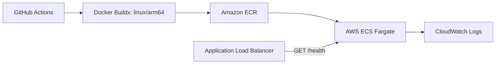

# Sudra Backend

Sudra Backend is a containerised FastAPI inference service for a TorchScript model that estimates ten trading-behaviour bias probabilities from chronological trade records. It turns validated API input into the exact engineered features, per-trader sequences, masks, and tensor shapes expected by the deployed model.

**Standalone repository:** [github.com/aarav34471/sudra-backend](https://github.com/aarav34471/sudra-backend)

## Architecture

```mermaid
flowchart LR
    Client[Client] --> API[FastAPI]
    API --> Validation[Pydantic validation]
    Validation --> Features[Feature engineering and normalisation]
    Features --> Sequences[Per-trader sequence batching]
    Sequences --> Masks[Causal and padding masks]
    Masks --> Model[TorchScript model]
    Model --> Thresholds[Per-label thresholds]
    Thresholds --> Response[Bias probabilities and labels]
```



The deployment path is captured alongside the service:



## API

### `GET /health`

Reports whether the model loaded and exposes non-sensitive model dimensions used for operational health checks:

```json
{
  "status": "ok",
  "model_loaded": true,
  "model_artifact": "model_traced.pt",
  "n_labels": 10,
  "n_features_expected": 55
}
```

### `POST /predict`

Accepts one or more trades. Pydantic validates identifiers, timestamps, direction, and positive numeric values before preprocessing begins.

```json
{
  "trades": [
    {
      "trade_id": "T300_1",
      "trader_id": "T300",
      "symbol": "AAPL",
      "side": "long",
      "timestamp_open": "2025-08-18T09:42:00-04:00",
      "timestamp_close": "2025-08-18T10:05:00-04:00",
      "entry_price": 191.4,
      "exit_price": 193.1,
      "qty": 28
    }
  ]
}
```

An abridged response looks like this; the actual `labels` and `probs` collections contain all ten configured bias labels:

```json
{
  "threshold_default": 0.6,
  "thresholds_per_label": {
    "bias_overconfidence": 0.7
  },
  "n_traders": 1,
  "n_trades": 1,
  "feature_dim": 55,
  "labels": ["bias_overconfidence"],
  "preds": [
    {
      "trade_id": "T300_1",
      "trader_id": "T300",
      "symbol": "AAPL",
      "timestamp_open": "2025-08-18T09:42:00-04:00",
      "timestamp_close": "2025-08-18T10:05:00-04:00",
      "probs": {"bias_overconfidence": 0.12},
      "labels_above_threshold": []
    }
  ]
}
```

The complete 24-trade example in `sample_trades.json` exercises chronological feature generation for a single trader.

## ML Inference Pipeline

The service loads `artifacts/model_traced.pt` once when the application starts and treats `artifacts/config.json` as the inference contract. The configuration defines the ten label names, per-label decision thresholds, 55-column feature order, training-set normalisation statistics, ticker-bucket count, and whether the traced model accepts an attention mask.

For each request, the service:

1. parses timestamps and computes position value when it is not supplied;
2. sorts trades chronologically within each trader;
3. derives holding time, profit and loss, previous-trade comparisons, streaks, cumulative outcomes, historical medians, monthly activity, and symbol-concentration features;
4. adds deterministic hashed ticker features and a repeated-symbol indicator;
5. selects and standardises features in the exact configured order;
6. groups variable-length trader histories, pads them into a batch, and constructs causal and padding masks when required;
7. runs CPU TorchScript inference under `torch.inference_mode()`; and
8. applies the configured label-specific thresholds to the sigmoid probabilities returned for each trade.

## Running Locally

Python 3.11 is used by the container image.

```bash
python3 -m venv .venv
source .venv/bin/activate
pip install -r requirements.txt
uvicorn server_ts:app --host 0.0.0.0 --port 8000 --reload
```

In another terminal:

```bash
curl http://localhost:8000/health
curl -X POST http://localhost:8000/predict \
  -H "Content-Type: application/json" \
  --data @sample_trades.json
```

## Docker

```bash
docker build -t sudra-backend .
docker run --rm -p 8000:8000 \
  -e CORS_ORIGINS=http://localhost:5173 \
  sudra-backend
```

The image includes a Docker health check against `GET /health`. `ARTIFACT_DIR` can override the model/config directory, and `PORT` defaults to `8000`.

## AWS Deployment

The focused repository deploys the service to AWS ECS Fargate through GitHub Actions. Its workflow:

1. obtains AWS credentials from GitHub repository secrets;
2. configures QEMU and Docker Buildx;
3. builds and pushes a `linux/arm64` image to Amazon ECR, tagged with the commit SHA and `latest`;
4. renders the ECS task definition with the immutable image URI;
5. deploys the revision to the `sudra-cluster` service and waits for stability.

The ARM64 Fargate task exposes port `8000`. An Application Load Balancer checks `/health`, while the `awslogs` task configuration sends application output to the `/ecs/sudra-backend-task` CloudWatch log group.

The portfolio preserves the original workflow at [`deployment/github-actions/deploy-backend.yml`](deployment/github-actions/deploy-backend.yml). It is deployment evidence and is intentionally outside the portfolio repository's root `.github/workflows/`, so importing this project does not create an active portfolio-level deployment.

## Project Structure

```text
sudra-backend/
├── artifacts/
│   ├── config.json          # Feature, threshold, mask, and normalisation contract
│   └── model_traced.pt      # Public TorchScript inference artefact
├── deployment/
│   └── github-actions/
│       └── deploy-backend.yml
├── .dockerignore
├── .gitignore
├── Dockerfile
├── requirements.txt
├── sample_trades.json
├── server_ts.py
└── task-definition.json
```

## Limitations and Production Considerations

- Inference currently runs on CPU and the service does not expose concurrency or latency objectives.
- The API does not impose explicit request-size or per-request trade-count limits.
- Authentication, authorisation, and rate limiting are not implemented by this service.
- CORS defaults to `*`; deployments should always set an explicit allow-list.
- Startup depends on a compatible TorchScript artefact and matching config. Missing or incompatible files prevent the application from starting, which avoids silently serving a mismatched preprocessing contract.
- Predictions are generated independently for the records supplied in each request; the service does not persist trader history between requests.
